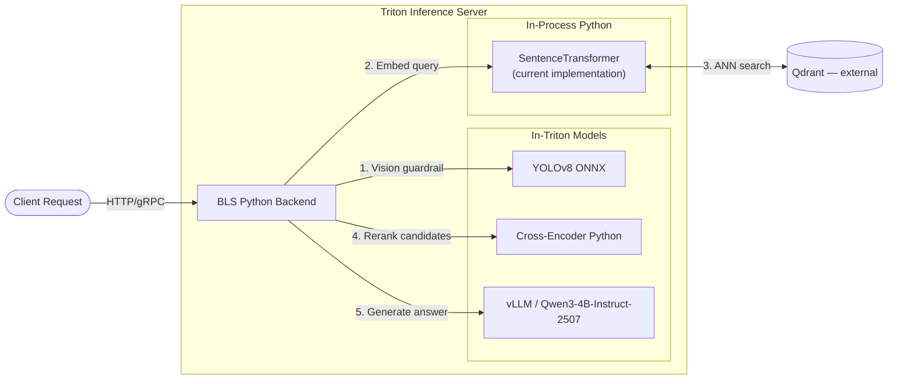

# Triton BLS Reference Architecture for Multimodal RAG


A demonstration of **production-oriented serving architecture** for multimodal Retrieval-Augmented Generation (RAG) on NVIDIA Triton Inference Server. The pipeline combines YOLO vision guardrails, Qdrant vector retrieval, cross-encoder reranking, and vLLM text generation — orchestrated entirely via **Business Logic Scripting (BLS)**.

> **This is not a production deployment.** It is an educational project for engineers learning to compose heterogeneous models inside a single Triton instance.

---

## What This Demonstrates

- **BLS orchestration** — a single Python backend coordinates vision, retrieval, reranking, and generation without client-side DAG logic
- **Model-agnostic serving** — the BLS call graph is independent of LLM identity or size; swap models via configuration
- **Retrieve-then-rerank RAG** — vector search followed by cross-encoder refinement to reduce hallucinations
- **Decoupled vLLM generation** — continuous batching via Triton's vLLM backend in decoupled mode
- **Serving boundary clarity** — in-Triton models, in-process Python libraries, and external services (Qdrant) are explicitly separated
- **Debug trace output** — per-stage latency and metadata returned with every response (see [Observability](docs/OBSERVABILITY.md))

---

## Validated Platform

Maintainer end-to-end validation on **2026-07-02** used the hardware and software below. Evidence: [docs/validation/plan-02-validation.md](docs/validation/plan-02-validation.md).

| Component | Version |
|-----------|---------|
| GPU | NVIDIA A100-SXM4-80GB |
| NVIDIA driver | 575.51.03 |
| CUDA | 12.9 |
| Python | 3.12.12 |
| uv | 0.9.7 |
| Triton | 25.05-py3 |
| vLLM | 0.10.2 |
| vLLM backend | `b41f716` (r25.05) |
| Qdrant | v1.16.3 |
| LLM | `Qwen/Qwen3-4B-Instruct-2507` |
| Embedding | `sentence-transformers/all-MiniLM-L6-v2` |

This table records **what was tested**, not a compatibility guarantee for other GPUs.

---

## Expected-Compatible Hardware

The default configuration targets **Qwen3-4B-Instruct-2507** on a **single GPU with approximately 16–24 GB VRAM**. Consumer cards such as RTX 3090 or RTX 4090 are typical fits based on the VRAM budget below.

**Expected compatibility is not the same as validated hardware.** The maintainer run above used an NVIDIA A100-SXM4-80GB; consumer GPUs in the 16–24 GB class have not been individually validated in this repository unless listed in the validated platform table.

| Component | Approximate VRAM |
|-----------|-----------------|
| Qwen3-4B-Instruct-2507 (vLLM, FP16) | ~8 GB |
| YOLOv8n (ONNX) | ~0.5 GB |
| Cross-encoder reranker | ~0.5 GB |
| SentenceTransformer embedder (in-process) | ~0.5 GB |
| **Total estimate** | **~10–14 GB** |

Cold-start includes HuggingFace model downloads (~8 GB for Qwen3-4B-Instruct-2507 weights) and Triton model loading (2–5 minutes depending on disk and network).

See [Quickstart](docs/QUICKSTART.md) for step-by-step setup and troubleshooting.

---

## Known Limitations

- **Not production-ready** — no authentication, rate limiting, persistence guarantees, or HA deployment
- **Current embedding implementation** — BLS uses in-process `SentenceTransformer`; `embedding_onnx` is exported separately and not yet wired into the serving path ([Plan 03](docs/plans/plan-03-engineering-hardening.md))
- **No bundled observability stack** — Triton exposes Prometheus metrics; Grafana dashboards are not included
- **Synthetic knowledge base** — `data/knowledge_base.json` is hand-authored sample data, not production documentation
- **Generation env vars** — `LLM_TEMPERATURE`, `LLM_MAX_TOKENS`, and `LLM_TOP_P` are defined but not yet consumed by BLS ([Plan 03](docs/plans/plan-03-engineering-hardening.md))

---

## Model Substitution

The BLS orchestration DAG is **model-agnostic**. To use a larger LLM (e.g. Qwen3-30B MoE on a datacenter GPU):

1. Set `LLM_MODEL_ID` in `.env` (used by the BLS tokenizer)
2. Update the `"model"` field in `model_repository/llm_vllm/1/model.json` (used by the vLLM backend)
3. Adjust `max_model_len` and `gpu_memory_utilization` in `model.json` for your GPU
4. Rebuild/restart the Triton container

No changes to `bls_orchestrator/1/model.py` are required — the inference call graph stays the same.

---

## Architecture




> **Note:** `embedding_onnx` is also defined in the model repository as an exported ONNX variant. The BLS path above uses in-process `SentenceTransformer` by design today. See [Model Repository Guide](docs/MODEL_REPOSITORY.md) for details.

**Detailed design:** [docs/ARCHITECTURE.md](docs/ARCHITECTURE.md) · **Model store reference:** [docs/MODEL_REPOSITORY.md](docs/MODEL_REPOSITORY.md)

### Pipeline Stages

1. **Input** — client sends a text query and a 640×640 FP32 image tensor
2. **Vision guardrail** — `yolo_onnx` scans the image (output currently used for trace metadata)
3. **Retrieval** — `SentenceTransformer` embeds the query; BLS queries Qdrant for top-5 candidates
4. **Reranking** — `reranker_py` cross-encoder scores candidates; best document becomes LLM context
5. **Generation** — `llm_vllm` (vLLM, decoupled) produces the final answer

---

## Tech Stack

| Layer | Technology |
|-------|-----------|
| Orchestration | NVIDIA Triton Inference Server 25.05 |
| LLM serving | vLLM 0.10.2 (decoupled mode) |
| Vector DB | Qdrant |
| LLM (default) | `Qwen/Qwen3-4B-Instruct-2507` |
| Vision | YOLOv8n (ONNX) |
| Embeddings | `sentence-transformers/all-MiniLM-L6-v2` |
| Reranker | `cross-encoder/ms-marco-MiniLM-L-6-v2` |
| Dependencies | uv |

---

## Project Structure

```text
.
├── client.py                  # HTTP client with trace reporting
├── main.py                    # Entrypoint (delegates to client.py)
├── data/                      # Test images and synthetic knowledge base
├── docker-compose.yml         # Qdrant + Triton services
├── Dockerfile                 # Custom Triton image (vLLM backend)
├── docs/                      # Architecture, quickstart, observability guides
├── model_repository/          # Triton model store
│   ├── bls_orchestrator/      # BLS Python backend (orchestrator)
│   ├── yolo_onnx/             # Vision model (ONNX)
│   ├── embedding_onnx/        # Embedding export (not active path)
│   ├── reranker_py/           # Cross-encoder (Python)
│   └── llm_vllm/              # LLM (vLLM backend)
└── scripts/                   # Model export and Qdrant initialization
```

---

## Quick Start

Use the Makefile for the documented happy path (`make help` lists all targets):

```bash
uv sync --locked
cp .env.example .env

make export-models
make init-qdrant
make up          # start Qdrant + build/start Triton
make client      # run inference after models are READY
```

Equivalent manual steps:

```bash
uv sync --locked
cp .env.example .env

# Export YOLO, start Qdrant, initialize vector DB
uv run scripts/export_yolo.py
docker compose up -d qdrant
uv run scripts/init_qdrant.py

# Build and start Triton (wait for all models READY)
docker compose up -d --build triton

# Run inference
uv run client.py \
  --image data/test_image.jpg \
  --query "Red status LED is blinking continuously on my Router. What to do?"
```

Optional pre-check after Triton startup: `make smoke-test MODE=online` or `make smoke-test MODE=full`.

Full prerequisites, troubleshooting, and expected output: **[docs/QUICKSTART.md](docs/QUICKSTART.md)**

---

## Configuration

Configuration follows [12-Factor App](https://12factor.net/config) principles via environment variables. Copy `.env.example` to `.env` and adjust as needed — host scripts and the Triton container load this file automatically (see [CONFIGURATION.md](docs/CONFIGURATION.md)).

| Variable | Description | Default |
|----------|-------------|---------|
| `QDRANT_URL` | Vector DB endpoint | `http://localhost:6333` |
| `LLM_MODEL_ID` | HuggingFace model for BLS tokenizer | `Qwen/Qwen3-4B-Instruct-2507` |
| `LLM_TEMPERATURE` | Generation temperature | `0.1` |
| `EMBEDDING_MODEL_ID` | SentenceTransformer model | `all-MiniLM-L6-v2` |
| `RERANKER_MODEL_ID` | Cross-encoder model | `ms-marco-MiniLM-L-6-v2` |
| `YOLO_MODEL_NAME` | YOLO variant | `yolov8n` |

See [docs/CONFIGURATION.md](docs/CONFIGURATION.md) for the complete configuration reference.

---

## Example Output

The client prints a per-stage execution trace. Representative output below illustrates the response structure; latencies are approximate and will vary by hardware:

```text
============================================================
🕵️  PIPELINE EXECUTION REPORT
============================================================
Query: Red status LED is blinking continuously on my Router. What to do?
------------------------------------------------------------
🔹 [YOLOv8 (Vision)] -> ~600ms
------------------------------------------------------------
🔹 [Qdrant (Retrieval)] -> ~350ms
   Found: 5 docs
   Top-1: [Router] Red status LED blinking continuously...
------------------------------------------------------------
🔹 [Cross-Encoder (Reranker)] -> ~240ms
   Best Score: (varies)
   Context Used: "Check the router logs to identify the specific error code..."
------------------------------------------------------------
🔹 [vLLM (Generation)] -> ~3.8s
------------------------------------------------------------
⏱  Total Latency: ~5s
============================================================
🤖 AI RESPONSE:
Red status LED blinking continuously on your router typically indicates a critical error...
...
```

JSON response schema and trace field reference: [docs/OBSERVABILITY.md](docs/OBSERVABILITY.md)

---

## Design Decisions

- **Why Triton?** Triton provides a unified inference runtime for model lifecycle, scheduling, batching, and orchestration — keeping the client a thin HTTP caller instead of a pipeline coordinator.
- **Why BLS?** Chaining models via HTTP microservices adds network latency. BLS runs the DAG inside Triton's C++ runtime, sharing memory where possible.
- **Why Qwen3-4B-Instruct-2507 as default?** The educational goal is the **serving architecture**, not LLM scale. Qwen3-4B-Instruct-2507 runs on a single consumer GPU; larger models (Qwen3-30B MoE, etc.) are drop-in upgrades via `LLM_MODEL_ID` and `model.json`.
- **Why reranking?** Cosine similarity captures general semantics; a cross-encoder scores query–document pairs directly, improving context selection for RAG.

---

## Contributing & Security

- [CONTRIBUTING.md](CONTRIBUTING.md) — development setup and contribution guidelines
- [SECURITY.md](SECURITY.md) — vulnerability reporting (demonstration project, not a supported product)
- [docs/LICENSES.md](docs/LICENSES.md) — upstream model and data licenses

## License

This repository is licensed under the [MIT License](LICENSE). Upstream models and datasets carry their own licenses — see [docs/LICENSES.md](docs/LICENSES.md).
