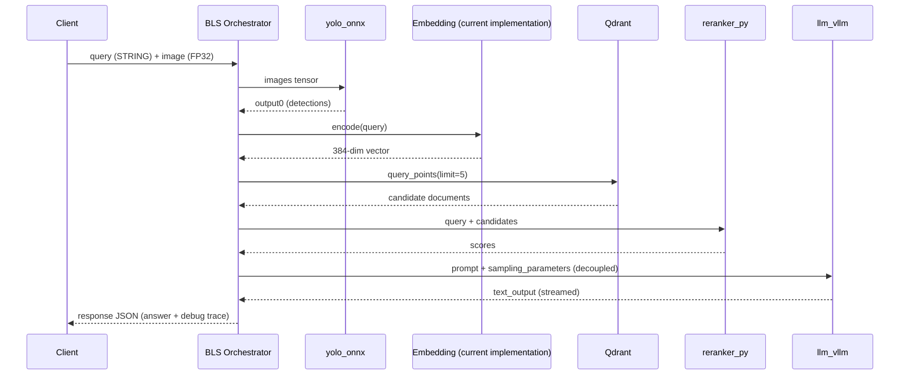

# Architecture

This document describes the system design of the Triton multimodal RAG reference implementation. For per-model tensor specifications, see [MODEL_REPOSITORY.md](MODEL_REPOSITORY.md). For setup instructions, see [QUICKSTART.md](QUICKSTART.md).

---

## Overview

The system implements a **retrieve-then-rerank** multimodal RAG pipeline for technical support scenarios. A client sends a text query and an equipment photo; the BLS orchestrator coordinates vision screening, vector retrieval, cross-encoder reranking, and LLM generation — returning a JSON response with the answer and a per-stage debug trace.

The architecture is a **single-runtime multi-model** design: a single Triton instance hosts multiple specialized model backends, minimizing network hops for tensor movement while keeping orchestration logic server-side.

---

## Components

| Component | Location | Responsibility |
|-----------|----------|---------------|
| **Client** (`client.py`) | Host machine | Loads image, sends HTTP inference request, prints trace report |
| **Triton Inference Server** | Docker container | Hosts all model backends and the BLS orchestrator |
| **BLS Orchestrator** (`bls_orchestrator`) | In-Triton Python backend | Executes the RAG DAG via `InferenceRequest` calls |
| **YOLO** (`yolo_onnx`) | In-Triton ONNX backend | Vision guardrail — scans input image |
| **Embedder** (`SentenceTransformer`) | In-process Python (BLS `initialize`) | Encodes query text to a 384-dim vector |
| **Qdrant** | External Docker service | Approximate nearest-neighbor search over knowledge base |
| **Reranker** (`reranker_py`) | In-Triton Python backend | Cross-encoder scoring of query–document pairs |
| **LLM** (`llm_vllm`) | In-Triton vLLM backend | Generates final answer from retrieved context |

### Serving Boundaries

Understanding where code runs is critical for production planning:

| Boundary | Examples | Notes |
|----------|----------|-------|
| **In-Triton model backends** | `yolo_onnx`, `reranker_py`, `llm_vllm` | Loaded by Triton; invoked via BLS `InferenceRequest` |
| **In-process Python libraries** | `SentenceTransformer`, `QdrantClient`, `AutoTokenizer` | Loaded in BLS `initialize()`; not separate Triton models |
| **External services** | Qdrant | Network call from BLS; not managed by Triton |

> **Current embedding implementation:** The BLS path uses in-process `SentenceTransformer.encode()` by design today. An `embedding_onnx` model is also defined in the model repository (with export script `scripts/export_embedding.py`). [Plan 03](plans/plan-03-engineering-hardening.md) will evaluate whether the serving path should be unified under the ONNX backend.

---

## Sequence Diagram



---

## BLS Call Graph

The orchestrator in `model_repository/bls_orchestrator/1/model.py` executes stages sequentially:

```
Input: query (BYTES), image (FP32 [1,3,640,640])
  │
  ├─► InferenceRequest → yolo_onnx
  │     inputs:  images
  │     outputs: output0
  │
  ├─► SentenceTransformer.encode(query)  [in-process, not InferenceRequest]
  │
  ├─► QdrantClient.query_points()        [external vector database]
  │
  ├─► InferenceRequest → reranker_py
  │     inputs:  query, candidates
  │     outputs: scores
  │
  └─► InferenceRequest → llm_vllm (decoupled=True)
        inputs:  text_input, sampling_parameters, stream
        outputs: text_output
  │
  ▼
Output: response (BYTES) — JSON { "answer": "...", "debug": { ... } }
```

---

## Model-Agnostic Orchestration

The BLS DAG is **independent of LLM identity or size**. The orchestrator:

1. Builds a chat prompt using `AutoTokenizer.apply_chat_template()` (tokenizer loaded from `LLM_MODEL_ID`)
2. Sends the prompt to `llm_vllm` via a standard `InferenceRequest`

Swapping the LLM requires only configuration changes:

- `LLM_MODEL_ID` environment variable (BLS tokenizer)
- `"model"` field in `model_repository/llm_vllm/1/model.json` (vLLM backend)
- VRAM sizing adjustments in `model.json`

No changes to the BLS Python code or call graph are needed. This separation keeps orchestration independent from model evolution.

---

## Decoupled vLLM Behavior

The LLM stage uses `llm_req.exec(decoupled=True)`, enabling vLLM's continuous batching mode through Triton's decoupled transaction policy. The BLS iterates over response objects until generation completes, concatenating `text_output` chunks.

Representative `model.json` configuration for the default Qwen3-4B-Instruct-2507 setup (values may evolve):

| Parameter | Value | Purpose |
|-----------|-------|---------|
| `tensor_parallel_size` | 1 | Single-GPU serving |
| `max_model_len` | 8192 | Context window limit |
| `gpu_memory_utilization` | 0.85 | vLLM KV cache allocation |
| `max_num_seqs` | 4 | Concurrent sequence limit |

---

## Tensor Movement Rationale

Keeping models inside Triton avoids serializing/deserializing tensors over HTTP between microservices. The BLS backend passes tensor references directly to child model backends via `InferenceRequest`. Keeping orchestration inside Triton also simplifies the client, which submits a single inference request rather than coordinating multiple service calls. The main exception is Qdrant retrieval, which requires a network round-trip because vector search runs in an external database.

---

## Production Adaptation Considerations

> **Design notes only.** None of the following are implemented in this reference repository.

| Concern | Consideration |
|---------|----------------|
| **Warmup** | First inference after startup incurs model loading and CUDA kernel compilation latency; implement warmup requests before serving traffic |
| **GPU memory sizing** | Default Qwen3-4B-Instruct-2507 fits ~16 GB GPUs; larger models require dedicated GPUs or tensor parallelism |
| **Timeouts** | BLS has no per-stage timeout; a slow LLM blocks the entire request — add deadline propagation in production |
| **Authentication** | Triton HTTP/gRPC endpoints are unauthenticated; place behind an API gateway with auth |
| **Persistence** | Qdrant data is stored in a Docker volume; back up `infra/qdrant_storage` for durability |
| **Scaling limits** | Single Triton instance, single GPU; horizontal scaling requires model replication and load balancing |
| **Error handling** | BLS continues on partial failures (e.g., empty reranker scores); production should define fail-fast policies |
| **Observability** | Debug traces are returned per-request; Triton Prometheus metrics are available at `:8002/metrics` (see [OBSERVABILITY.md](OBSERVABILITY.md)) |

---

## Related Documentation

- [README.md](../README.md) — repository overview
- [MODEL_REPOSITORY.md](MODEL_REPOSITORY.md) — per-model configs, tensors, and instance groups
- [QUICKSTART.md](QUICKSTART.md) — setup and troubleshooting
- [OBSERVABILITY.md](OBSERVABILITY.md) — trace schema and metrics
- [LICENSES.md](LICENSES.md) — upstream model licenses
